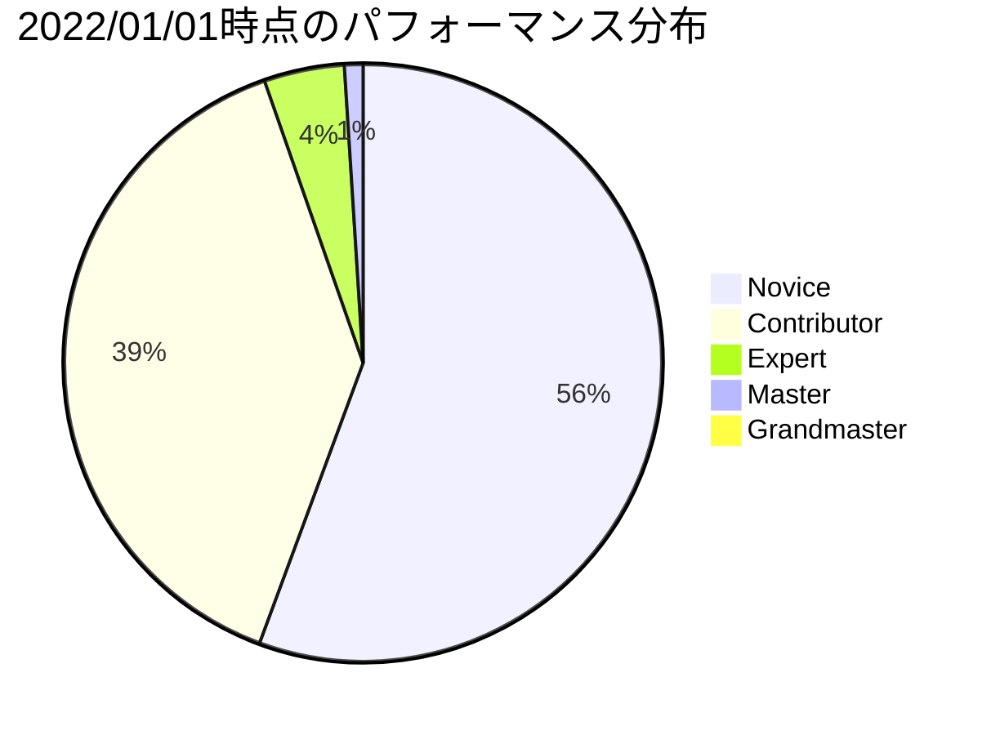

# Kaggle入門
## 01.概要
`Kaggle` は、機械学習モデルを構築するコンペティションのプラットフォーム.
 
企業や研究者がデータを投稿し、世界中の統計家やデータ分析者が機械学習モデルを構築してスコアを競います.

## 02.Tiers
コンテスト等で入賞すると,ユーザのランクが変動する. 
ユーザ登録時は全員 `Novice` から始まり, `Grandmaster` が最高ランクとなる.
| Tiers       | url                                        |
| ----------- | ------------------------------------------ |
| Novice      | [link](https://www.kaggle.com/progression) |
| Contributor | [link](https://www.kaggle.com/progression) |
| Expert      | [link](https://www.kaggle.com/progression) |
| Master      | [link](https://www.kaggle.com/progression) |
| Grandmaster | [link](https://www.kaggle.com/progression) |

ユーザ分布は以下通りであり,[Kaggle Rankings](https://www.kaggle.com/rankings?group=competitions&page=1&pageSize=20)にて確認できる.

## 03.コンペティションの種類
代表的なコンペは以下の通り. 
その他は[link](https://www.kaggle.com/docs/competitions)を参照. 
| Competitions    | 役割                                                                                         |
| --------------- | -------------------------------------------------------------------------------------------- |
| Getting Started | メダルがなくランキングに反映されない練習用コンペ. 半永久的に開催されている.            |
| Playground      | `Getting Started` より難易度が一段階上のお楽しみコンペ. 少額の賞金や景品が獲得できる.  |
| Featured        | 一般的なコンペ. 賞金やメダルが獲得できる.                                              |
| Research        | `Featured` よりも実験的な問題を扱うコンペ. 賞金やメダルが獲得できる.                   |

## 04.コンペティションの提出種類
[competition-formats](https://www.kaggle.com/docs/competitions#competition-formats)を参照. 
| Competition formats      | 役割                                                                                                                                                                                                                                                                                                                                               |
| ------------------------ | -------------------------------------------------------------------------------------------------------------------------------------------------------------------------------------------------------------------------------------------------------------------------------------------------------------------------------------------------- |
| Simple   Competitions    | 標準のKaggleコンペで利用される. ローカルorノートブックでモデルを構築し,予測結果ファイルをKaggleにアップロードすることで競う形式.                                                                                                                                                                                                             |
| Two-stage   Competitions | xxx                                                                                                                                                                                                                                                                                                                                                |
| Code   Competitions      | 全てKaggle Notebook上で作成するコンペ. 提出物を直接コンペにアップロードすることはできない. このコンペには2種類の特徴がある. ・全ユーザが同じマシンスペックで競技するため,参加者のバランスが取れている. ・また,プラットフォームによって課せられた制約内のスペックで実行する必要があるため,他のコンペよりもモデルは単純になる傾向がある. |

## 05.Leaderboard
コンペの順位表のこと. 
テストデータの `oo%` に対してのモデル順位がPublic Leaderboardに、それ以外の `oo%` に対してのモデル順位がPrivate Leaderboardに記録される. 
モデルの提出回数が多いと最終順位が良くなるよう調整が可能なため,`Public` と `Private` でデータやLeaderboardが分けられている. 
基本的にデータ量は `Private > Public` となる. 

| Leaderboard         | 役割                                          |
| ------------------- | --------------------------------------------- |
| Public Leaderboard  | テストデータの一部で評価された暫定順位表.  |
| Private Leaderboard | コンペ終了後に発表される最終順位表.        |
